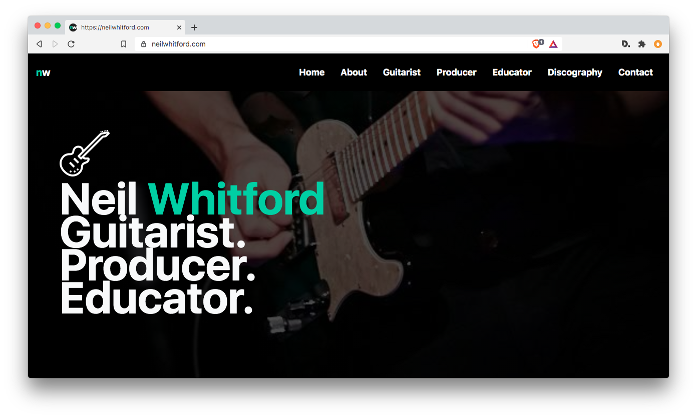

# **Neil Whitford**

A custom website build for Toronto musician Neil Whitford. The project included UI/graphic design, photo sourcing, development, UX copywriting & was built with PHP, Bootstrap 4, SWUP.js, rellax.js, and audio embeds from hearthis.at & soundcloud.

For more information see [neilwhitford.com](https://neilwhitford.com).

## **Layout and Frameworks**

The site uses Bootstrap 4.1. Layout uses native Bootstrap classes, flexbox, and functional css.

## **PHP**

PHP is used for reusable header and footer components.

## **CSS**

1. Functional [Atomic] css: the site employs the atomic css approach where small, single purpose classes are used based on function. Where possible native Bootstrap classes were used as much as possible.

## **JS**

**Multiple JS plugins are used on the site.**

1. swup: an ajax plugin that hijacks http requests, swapping page content out without page refresh. Significantly improves view change speed and performance in addition to allowing for entrance and exit animations.

2. AOS: animate on scroll. A simple css based animation library that activates a variety of css animations on scroll.

3. Rellax.js: A parallax animation library allowing a wide range of customizations. It was used on shapes, images, and page hero banners throughout the site.

## **.htaccess**

1. Simple .htaccess rewrites are employed to remove `.php` extensions for pretty urls.
2. The production site removes all .php file extensions for pretty urls, though this repo leaves extensions in so the local dev server will function. For every rebuild, remove .php extension from:

    - `nav.php`
    - `pagination.php`
    - `home_banner_component.php`
    - `footer.php`